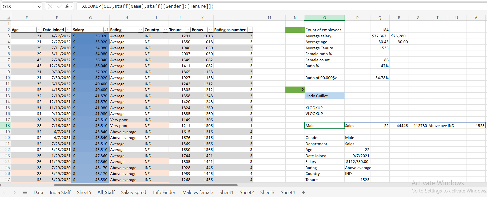
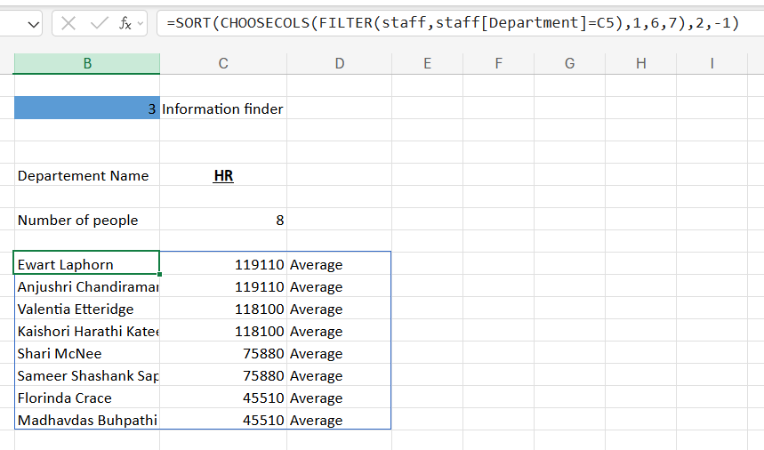
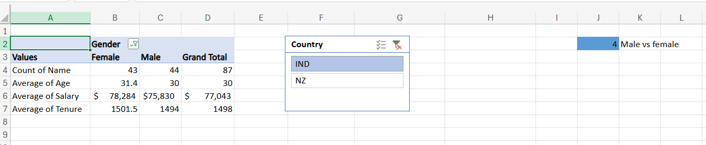
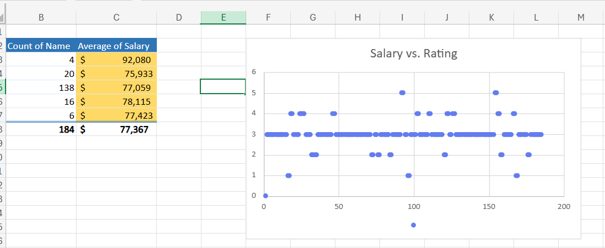
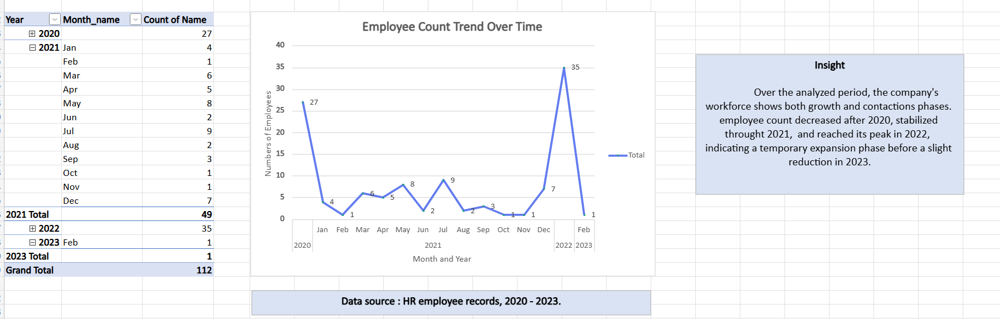
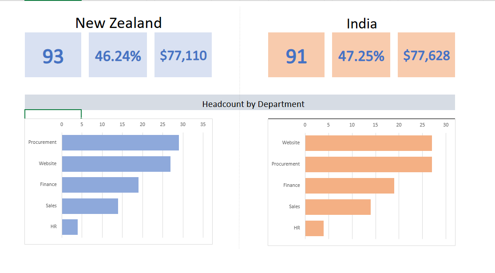

# employee-data-analysis

---

## 🧹 Data Preparation

- Combined two raw Excel files (`India Staff` and `All Staff`) into one unified dataset.  
- Cleaned and standardized columns (renamed, removed duplicates, handled missing values).  
- Converted `Salary` to USD format and added computed columns:
  - **Bonus Added Salary** → `=Salary + Bonus`
  - **Tenure (Years)** → `=DATEDIF([@Date Joined],TODAY(),"y")`
  - **Month-Year** → `=TEXT([@Date Joined],"mmm yyyy")`
- Created numeric mapping for ratings (1–5 scale) using `XLOOKUP`.

For detailed technical notes, see:  
📄 [`docs/data-cleaning-notes.md`](docs/data-cleaning-notes.md)

---

## 📊 Excel Dashboard Previews

### 🔹 KPI & Employee Information Finder
Dynamic KPI summary showing overall workforce metrics and an employee lookup area using **XLOOKUP** and **VLOOKUP**.

---

### 🔹 Department Information Finder
Dynamic department-based view using Excel’s **FILTER**, **SORT**, and **CHOOSECOLS** functions.  
Users can enter a department name to instantly display all employees, salaries, and ratings.

---

### 🔹 Gender Comparison (Male vs Female)
PivotTable comparing male and female employees in terms of headcount, age, salary, and tenure, with an interactive **Country Slicer**.

---

### 🔹 Salary vs Rating
PivotTable and Scatter Chart analyzing how performance ratings relate to salary levels.

---

### 🔹 Employee Count Trend (2020–2023)
Line chart showing monthly employee count evolution across four years, visualizing company growth and contraction phases.

---

### 🔹 Country Comparison Dashboard (India vs New Zealand)
Side-by-side visual summary comparing the two countries in terms of headcount, percentage share, and average salary.  
Also includes horizontal bar charts for departmental distribution.

---

## 📘 Key Excel Features Used

| Category | Functions / Tools |
|-----------|-------------------|
| **Formulas** | `FILTER`, `SORT`, `CHOOSECOLS`, `XLOOKUP`, `VLOOKUP`, `COUNTIFS`, `AVERAGEIFS`, `DATEDIF`, `TEXT`, `TRIM` |
| **PivotTables** | Aggregations for gender, rating, time trend |
| **Charts** | Line, bar, scatter |
| **Slicers** | Country filter for interactive dashboards |
| **Conditional Formatting** | Highlights salary thresholds and gender ratios |
| **Dynamic Arrays** | Used to create responsive lists and info panels |

---

## 📈 Insights Summary

- Workforce evenly distributed between **India (47%)** and **New Zealand (46%)**  
- Gender ratio nearly equal, with no significant salary gap  
- Salaries remain stable across performance ratings (avg ≈ $77K)  
- Employee hiring peaked in **2022**, then stabilized in early 2023  
- Department distribution differs slightly by region:
  - NZ: Procurement & Website are largest
  - India: Website & Finance lead

---

## ⚙️ Technical Setup

- **Software:** Microsoft Excel (Excel 365 / Excel Online)
- **Version Control:** Git + Git LFS for Excel files
- **File format:** `.xlsx`
- **Optional visualization exports:** Screenshots in `images/`

---

## 💾 How to Use

1. Download `data/blank-data-file.xlsx`
2. Open it in **Excel Desktop** or **Excel Online**
3. Explore the sheets:
   - *Info Finder* → Search for employee data  
   - *Male vs Female* → Compare gender stats  
   - *Salary vs Rating* → Review pay-performance correlation  
   - *Sheet3* → Employee trend over time  
   - *Sheet4* → Country comparison dashboard
4. Refresh PivotTables if you add new records.

---

## 🧩 Version Control Files

| File | Purpose |
|------|----------|
| `.gitignore` | Ignores temporary Excel and system files |
| `.gitattributes` | Enables Git LFS tracking for `.xlsx` files |

---

## 🪪 License

This project is released under the **MIT License** © 2025 [Your Name]

---

## 👤 Author

Created by **Bodea Dana**  
📅 Year: 2025  
🔗 GitHub: [YourUsername](https://github.com/YourUsername)

---

> _“Turning raw HR data into meaningful workforce insights using Excel’s analytical power.”_
